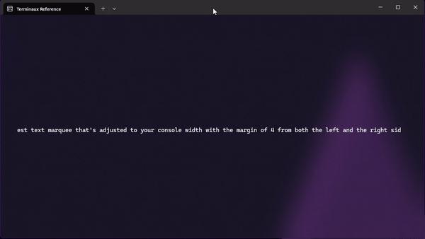
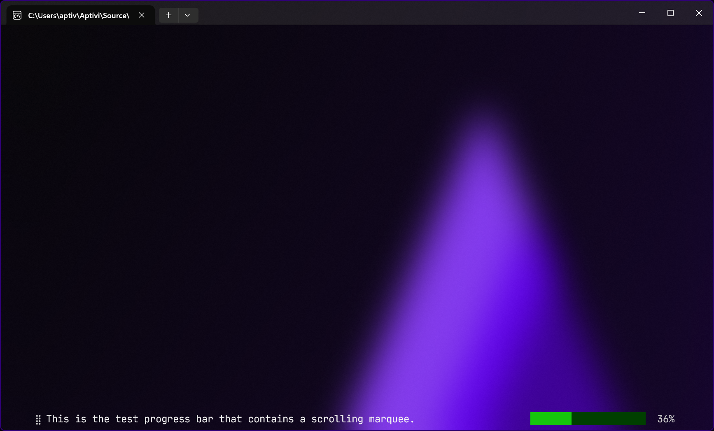

# Cyclic Writers

Cyclic writers are dynamic writers that can be rendered individually by making a new class instance of a renderable class that implements the `IStaticRenderable` interface that you can implement in your renderable class. Such writers can either be animated or static, and can be rendered either by calling their individual `Render()` function one by one or by putting renderable classes to a container and calling that container's `WriteContainer()` function from the `ContainerTools` class. The following built-in cyclic writers are available:

* Shapes
  * `Circle`
  * `Ellipsis`
  * `Parallelogram`
  * `Rectangle`
  * `Square`
  * `Trapezoid`
  * `Triangle`
  * `Line`
* Charts
  * `BreakdownChart`
  * `BarChart`
  * `StickChart`
* Text
  * `AlignedFigletText`
  * `AlignedText`
  * `BoundedText`
  * `FigletText`
  * `TextMarquee`
* Artistic
  * `Border`
  * `Box`
  * `BoxFrame`
  * `Canvas`
* Misc
  * `Asciinema` (WIP)
  * `ProgressBar`
  * `ProgressBarNoText`
  * `Spinner`
    * Built-in spinners are available in the `BuiltinSpinners` class.
  * `Table`

You can define a container by creating a new instance of the `Container` class and adding some of the renderables that can be identified by their name. You can also set their positions by using the `SetRenderablePosition()` function.


Some of the renderables may override the position variable for a renderable and may use the values from the renderables' properties.


In addition to that, you can manipulate with a renderable using the following functions:

* `IsRegistered()`: Checks to see if a renderable with this ID is registered or not.
* `RemoveRenderable()`: Removes a renderable with this ID.
* `GetRenderable()`: Gets a renderable instance from this ID.
* `GetRenderablePosition()`: Gets a renderable instance position from this ID.
* `GetRenderableNames()`: Gets an array of renderable IDs.

## Shapes

You can render the following shapes directly to your console:

### Circle

The circle writer allows you to write a circle to the console. It also allows you to either draw just an outline or the whole filled circle.



```csharp
var shape = new Circle(20, 2, 1);
TextWriterRaw.WriteRaw(shape.Render());
```

<figure><figcaption></figcaption></figure>



```csharp
var shape = new Circle(20, 2, 1, true);
TextWriterRaw.WriteRaw(shape.Render());
```

<figure><figcaption></figcaption></figure>



### Ellipsis

This writer allows you to write an ellipsis directly to the console. It also allows you to either draw just an outline or the whole filled ellipsis.



```csharp
var shape = new Ellipsis(40, 15, 2, 1);
TextWriterRaw.WriteRaw(shape.Render());
```

<figure><figcaption></figcaption></figure>



```csharp
var shape = new Ellipsis(40, 15, 2, 1, true);
TextWriterRaw.WriteRaw(shape.Render());
```

<figure><figcaption></figcaption></figure>



### Parallelogram

This writer allows you to write a parallelogram to the console directly. You can specify whether to draw just the outline or the whole shape.



```csharp
var shape = new Parallelogram(40, 10, 2, 1);
TextWriterRaw.WriteRaw(shape.Render());
```

<figure><figcaption></figcaption></figure>



```csharp
var shape = new Parallelogram(40, 10, 2, 1, true);
TextWriterRaw.WriteRaw(shape.Render());
```

<figure><figcaption></figcaption></figure>



### Rectangle

This writer allows you to write a rectangle to the console directly. You can specify whether to print the whole shape or just the edges.



```csharp
var shape = new Rectangle(40, 10, 2, 1);
TextWriterRaw.WriteRaw(shape.Render());
```

<figure><figcaption></figcaption></figure>



```csharp
var shape = new Rectangle(40, 10, 2, 1, true);
TextWriterRaw.WriteRaw(shape.Render());
```

<figure><figcaption></figcaption></figure>



### Square

This shape basically renders a rectangle, but with just the height specified. In the console, the width is multiplied by two due to the space widths taking up only one cell. It basically renders a square.



```csharp
var shape = new Square(20, 2, 1);
TextWriterRaw.WriteRaw(shape.Render());
```

<figure><figcaption></figcaption></figure>



```csharp
var shape = new Square(20, 2, 1, true);
TextWriterRaw.WriteRaw(shape.Render());
```

<figure><figcaption></figcaption></figure>



### Trapezoid

This renders a trapezoid using a specified height, a top edge width, and a bottom edge width. You can also make it either render just the outline or as a full shape.



```csharp
var shape = new Trapezoid(20, 60, 20, 2, 1);
TextWriterRaw.WriteRaw(shape.Render());
```

<figure><figcaption></figcaption></figure>



```csharp
var shape = new Trapezoid(20, 60, 20, 2, 1, true);
TextWriterRaw.WriteRaw(shape.Render());
```

<figure><figcaption></figcaption></figure>



### Triangle

This renders either an equilateral triangle or an isosceles triangle to the console.



```csharp
var shape = new Triangle(30, 20, 2, 1);
TextWriterRaw.WriteRaw(shape.Render());
```

<figure><figcaption></figcaption></figure>



```csharp
var shape = new Triangle(30, 20, 2, 1, true);
TextWriterRaw.WriteRaw(shape.Render());
```

<figure><figcaption></figcaption></figure>



## Charts

Presenting numbers, especially when comparing device performance benchmark numbers, can sometimes be clearer if you use a chart instead of a table. In order to use charts, you must specify at least the chart elements that can be described as an array of `ChartElement` class instances, which is usually set in the `Elements` property. You can create a new element like this:

```csharp
var element = new ChartElement()
{
    Name = "Element 1",
    Value = 12,
};
```

You must specify at least the name and the value to identify your element. However, elements can either have a random color (if the `Color` property isn't specified) or a specific color. It can also be hidden from view by enabling the `Hidden` property.

### Breakdown chart

This gives you a horizontal stick that describes what part of the whole stick has taken per each item. This describes a breakdown of several items that you want to present.



```csharp
var chart = new BreakdownChart()
{
    Left = 1,
    Top = 2,
    InteriorWidth = 60,
    Showcase = true,
    Elements =
    [
        new()
        {
            Name = "C#",
            Value = 80,
        },
        new()
        {
            Name = "Java",
            Value = 13,
        },
        new()
        {
            Name = "C++",
            Value = 6.9,
        },
        new()
        {
            Name = "Shell",
            Value = 0.1,
        },
    ]
};
TextWriterRaw.WriteRaw(chart.Render());
```

<figure><figcaption></figcaption></figure>



```csharp
var chart = new BreakdownChart()
{
    Left = 1,
    Top = 2,
    InteriorWidth = 60,
    Elements =
    [
        new()
        {
            Name = "C#",
            Value = 80,
        },
        new()
        {
            Name = "Java",
            Value = 13,
        },
        new()
        {
            Name = "C++",
            Value = 6.9,
        },
        new()
        {
            Name = "Shell",
            Value = 0.1,
        },
    ]
};
TextWriterRaw.WriteRaw(chart.Render());
```

<figure><figcaption></figcaption></figure>



### Bar chart

This gives you a horizontal bar chart that allows you to present various numbers in an amazing way for comparison.



```csharp
var chart = new BarChart()
{
    Left = 1,
    Top = 2,
    InteriorWidth = 60,
    Showcase = true,
    Elements =
    [
        new()
        {
            Name = "C#",
            Value = 80,
        },
        new()
        {
            Name = "Java",
            Value = 13,
        },
        new()
        {
            Name = "C++",
            Value = 6.9,
        },
        new()
        {
            Name = "Shell",
            Value = 0.1,
        },
    ]
};
TextWriterRaw.WriteRaw(chart.Render());
```

<figure><figcaption></figcaption></figure>



```csharp
var chart = new BarChart()
{
    Left = 1,
    Top = 2,
    InteriorWidth = 60,
    Elements =
    [
        new()
        {
            Name = "C#",
            Value = 80,
        },
        new()
        {
            Name = "Java",
            Value = 13,
        },
        new()
        {
            Name = "C++",
            Value = 6.9,
        },
        new()
        {
            Name = "Shell",
            Value = 0.1,
        },
    ]
};
TextWriterRaw.WriteRaw(chart.Render());
```

<figure><figcaption></figcaption></figure>



### Stick chart

This gives you a vertical bar chart that allows you to present various numbers in an amazing way for comparison.



```csharp
var chart = new StickChart()
{
    Left = 1,
    Top = 2,
    InteriorWidth = 60,
    InteriorHeight = 20,
    Showcase = true,
    Elements =
    [
        new()
        {
            Name = "C#",
            Value = 80,
        },
        new()
        {
            Name = "Java",
            Value = 13,
        },
        new()
        {
            Name = "C++",
            Value = 6.9,
        },
        new()
        {
            Name = "Shell",
            Value = 0.1,
        },
    ]
};
TextWriterRaw.WriteRaw(chart.Render());
```

<figure><figcaption></figcaption></figure>



```csharp
var chart = new StickChart()
{
    Left = 1,
    Top = 2,
    InteriorWidth = 60,
    InteriorHeight = 20,
    Elements =
    [
        new()
        {
            Name = "C#",
            Value = 80,
        },
        new()
        {
            Name = "Java",
            Value = 13,
        },
        new()
        {
            Name = "C++",
            Value = 6.9,
        },
        new()
        {
            Name = "Shell",
            Value = 0.1,
        },
    ]
};
TextWriterRaw.WriteRaw(chart.Render());
```

<figure><figcaption></figcaption></figure>



## Text

The following writers write text in different ways to the console.

### Aligned figlet text

This allows you to write an aligned Figlet text to the console.

```csharp
var text = new AlignedFigletText(FigletFonts.GetByName("small"), "Left")
{
    Settings = new()
    {
        Alignment = TextAlignment.Left
    }
};
var text2 = new AlignedFigletText(FigletFonts.GetByName("small"), "Middle")
{
    Settings = new()
    {
        Alignment = TextAlignment.Middle
    }
};
var text3 = new AlignedFigletText(FigletFonts.GetByName("small"), "Right")
{
    Settings = new()
    {
        Alignment = TextAlignment.Right
    }
};
TextWriterRaw.WriteRaw(text.Render());
TextWriterRaw.WriteRaw(text2.Render());
TextWriterRaw.WriteRaw(text3.Render());
```

<figure><figcaption></figcaption></figure>

### Aligned text

This allows you to write an aligned text to the console.

```csharp
var text = new AlignedText("Left")
{
    Settings = new()
    {
        Alignment = TextAlignment.Left
    }
};
var text2 = new AlignedText("Middle")
{
    Settings = new()
    {
        Alignment = TextAlignment.Middle
    }
};
var text3 = new AlignedText("Right")
{
    Settings = new()
    {
        Alignment = TextAlignment.Right
    }
};
TextWriterRaw.WriteRaw(text.Render());
TextWriterRaw.WriteRaw(text2.Render());
TextWriterRaw.WriteRaw(text3.Render());
```

<figure><figcaption></figcaption></figure>

### Bounded text

This allows you to write text with boundaries to the console to allow enough information to fit in a specified width and height. This works either according to lines, or according to column and row of the invisible caret.



```csharp
var text = new BoundedText("This is a bounded text that wraps. This is a bounded text that wraps. This is a bounded text that wraps. This is a bounded text that wraps. This is a bounded text that wraps. This is a bounded text that wraps. This is a bounded text that wraps.")
{
    Settings = new()
    {
        Alignment = TextAlignment.Left
    },
    Width = 30,
    Height = 5,
    Line = 1,
};
var text2 = new BoundedText("This is a bounded text that wraps. This is a bounded text that wraps. This is a bounded text that wraps. This is a bounded text that wraps. This is a bounded text that wraps. This is a bounded text that wraps. This is a bounded text that wraps.")
{
    Settings = new()
    {
        Alignment = TextAlignment.Left
    },
    Width = 30,
    Height = 5,
    Left = 40,
    Line = 2,
};
TextWriterRaw.WriteRaw(text.Render());
TextWriterRaw.WriteRaw(text2.Render());
```

<figure><figcaption></figcaption></figure>



```csharp
var text = new BoundedText("This is a bounded text that wraps. This is a bounded text that wraps. This is a bounded text that wraps. This is a bounded text that wraps. This is a bounded text that wraps. This is a bounded text that wraps. This is a bounded text that wraps.")
{
    Settings = new()
    {
        Alignment = TextAlignment.Left
    },
    Width = 30,
    Height = 5,
    PositionWise = true,
    Column = 5,
    Row = 4,
};
var text2 = new BoundedText("This is a bounded text that wraps. This is a bounded text that wraps. This is a bounded text that wraps. This is a bounded text that wraps. This is a bounded text that wraps. This is a bounded text that wraps. This is a bounded text that wraps.")
{
    Settings = new()
    {
        Alignment = TextAlignment.Left
    },
    Width = 30,
    Height = 5,
    Left = 40,
	PositionWise = true,
	Column = 5,
	Row = 5,
};
TextWriterRaw.WriteRaw(text.Render());
TextWriterRaw.WriteRaw(text2.Render());
```

<figure><figcaption></figcaption></figure>



### Figlet text

This allows you to write unaligned Figlet text to the console.

```csharp
var text = new FigletText(FigletFonts.GetByName("small"), "Figlet text");
TextWriterRaw.WriteRaw(text.Render());
```

<figure><figcaption></figcaption></figure>

### Text marquee

This allows you to write an animated text marquee to the console.

```csharp
var stickScreen = new Screen()
{
    CycleFrequency = 50,
};
var marquee = new TextMarquee(
    "This is the test text marquee that's adjusted to your console width with the margin of 4 from both the " +
    "left and the right side, and is intentionally long to make the text scroll just like how music players " +
    "work.")
{
    LeftMargin = 4,
    RightMargin = 4,
};
try
{
    // First, clear the screen
    ColorTools.LoadBack();

    // Then, show the counter
    var stickScreenPart = new ScreenPart();
    stickScreenPart.Position(4, ConsoleWrapper.WindowHeight / 2);
    stickScreenPart.AddDynamicText(marquee.Render);
    stickScreen.AddBufferedPart("Test", stickScreenPart);
    ScreenTools.SetCurrent(stickScreen);
    ScreenTools.SetCurrentCyclic(stickScreen);
    ScreenTools.StartCyclicScreen();
    Input.ReadKey();
}
catch (Exception ex)
{
    InfoBoxModalColor.WriteInfoBoxModal($"Screen failed to render: {ex.Message}");
}
finally
{
    ScreenTools.StopCyclicScreen();
    ScreenTools.UnsetCurrent(stickScreen);
    ColorTools.LoadBack();
}
```

<figure><figcaption></figcaption></figure>

## Artistic

This allows you to draw artistic stuff into the console so that you can build your own interactive console applications easily.

### Border

You can render a nice border to the console either without any text, just a title, a text, or box title and text. You can also customize the borders.



```csharp
var artistic = new Border()
{
    Left = 2,
    Top = 1,
    InteriorWidth = 20,
    InteriorHeight = 10,
};
TextWriterRaw.WriteRaw(artistic.Render());
```

<figure><figcaption></figcaption></figure>



```csharp
var artistic = new Border()
{
    Left = 2,
    Top = 1,
    InteriorWidth = 20,
    InteriorHeight = 10,
    Title = "Border title",
};
TextWriterRaw.WriteRaw(artistic.Render());
```

<figure><figcaption></figcaption></figure>



```csharp
var artistic = new Border()
{
    Left = 2,
    Top = 1,
    InteriorWidth = 20,
    InteriorHeight = 10,
    Text = "Border text",
};
TextWriterRaw.WriteRaw(artistic.Render());
```

<figure><figcaption></figcaption></figure>



```csharp
var artistic = new Border()
{
    Left = 2,
    Top = 1,
    InteriorWidth = 20,
    InteriorHeight = 10,
    Title = "Border title",
    Text = "Border text",
};
TextWriterRaw.WriteRaw(artistic.Render());
```

<figure><figcaption></figcaption></figure>



### Box

You can render a box to the terminal easily.

```csharp
var artistic = new Box()
{
    Left = 2,
    Top = 1,
    InteriorWidth = 20,
    InteriorHeight = 10,
    Color = ConsoleColors.Magenta3
};
TextWriterRaw.WriteRaw(artistic.Render());
```

<figure><figcaption></figcaption></figure>

### Box frame

It's basically the same as a border, but without text support and without filling inside the box



```csharp
var artistic = new BoxFrame("")
{
    Left = 2,
    Top = 1,
    InteriorWidth = 20,
    InteriorHeight = 10,
};
TextWriterRaw.WriteRaw(artistic.Render());
```

<figure><figcaption></figcaption></figure>



```csharp
var artistic = new BoxFrame("Text")
{
    Left = 2,
    Top = 1,
    InteriorWidth = 20,
    InteriorHeight = 10,
};
TextWriterRaw.WriteRaw(artistic.Render());
```

<figure><figcaption></figcaption></figure>



### Canvas

This is your sandbox for your awesome creations. This is done by coloring individual pixels with a color of your choice.



```csharp
var artistic = new Canvas()
{
	Left = 2,
	Top = 2,
	Color = ConsoleColors.Green,
	DoubleWidth = false,
	Transparent = true,
	InteriorWidth = 20,
	InteriorHeight = 20,
	Pixels =
	[
        // Draw the top part of the "T" letter
        new(2, 2) { CellColor = ConsoleColors.Yellow },
		new(3, 2) { CellColor = ConsoleColors.Yellow },
		new(4, 2) { CellColor = ConsoleColors.Yellow },
		new(5, 2) { CellColor = ConsoleColors.Yellow },
		new(6, 2) { CellColor = ConsoleColors.Yellow },
		new(7, 2) { CellColor = ConsoleColors.Yellow },
		new(8, 2) { CellColor = ConsoleColors.Yellow },
		new(9, 2) { CellColor = ConsoleColors.Yellow },
		new(10, 2) { CellColor = ConsoleColors.Yellow },
		new(11, 2) { CellColor = ConsoleColors.Yellow },
		new(12, 2) { CellColor = ConsoleColors.Yellow },
		new(13, 2) { CellColor = ConsoleColors.Yellow },
		new(14, 2) { CellColor = ConsoleColors.Yellow },
		new(15, 2) { CellColor = ConsoleColors.Yellow },
		new(16, 2) { CellColor = ConsoleColors.Yellow },
		new(17, 2) { CellColor = ConsoleColors.Yellow },
		new(18, 2) { CellColor = ConsoleColors.Yellow },
		new(2, 3) { CellColor = ConsoleColors.Yellow },
		new(3, 3) { CellColor = ConsoleColors.Yellow },
		new(4, 3) { CellColor = ConsoleColors.Yellow },
		new(5, 3) { CellColor = ConsoleColors.Yellow },
		new(6, 3) { CellColor = ConsoleColors.Yellow },
		new(7, 3) { CellColor = ConsoleColors.Yellow },
		new(8, 3) { CellColor = ConsoleColors.Yellow },
		new(9, 3) { CellColor = ConsoleColors.Yellow },
		new(10, 3) { CellColor = ConsoleColors.Yellow },
		new(11, 3) { CellColor = ConsoleColors.Yellow },
		new(12, 3) { CellColor = ConsoleColors.Yellow },
		new(13, 3) { CellColor = ConsoleColors.Yellow },
		new(14, 3) { CellColor = ConsoleColors.Yellow },
		new(15, 3) { CellColor = ConsoleColors.Yellow },
		new(16, 3) { CellColor = ConsoleColors.Yellow },
		new(17, 3) { CellColor = ConsoleColors.Yellow },
		new(18, 3) { CellColor = ConsoleColors.Yellow },
        
        // Draw the line of the "T" letter
        new(9, 3) { CellColor = ConsoleColors.Yellow },
		new(9, 4) { CellColor = ConsoleColors.Yellow },
		new(9, 5) { CellColor = ConsoleColors.Yellow },
		new(9, 6) { CellColor = ConsoleColors.Yellow },
		new(9, 7) { CellColor = ConsoleColors.Yellow },
		new(9, 8) { CellColor = ConsoleColors.Yellow },
		new(9, 9) { CellColor = ConsoleColors.Yellow },
		new(9, 10) { CellColor = ConsoleColors.Yellow },
		new(9, 11) { CellColor = ConsoleColors.Yellow },
		new(9, 12) { CellColor = ConsoleColors.Yellow },
		new(9, 13) { CellColor = ConsoleColors.Yellow },
		new(9, 14) { CellColor = ConsoleColors.Yellow },
		new(9, 15) { CellColor = ConsoleColors.Yellow },
		new(9, 16) { CellColor = ConsoleColors.Yellow },
		new(9, 17) { CellColor = ConsoleColors.Yellow },
		new(9, 18) { CellColor = ConsoleColors.Yellow },
		new(9, 19) { CellColor = ConsoleColors.Yellow },
		new(10, 3) { CellColor = ConsoleColors.Yellow },
		new(10, 4) { CellColor = ConsoleColors.Yellow },
		new(10, 5) { CellColor = ConsoleColors.Yellow },
		new(10, 6) { CellColor = ConsoleColors.Yellow },
		new(10, 7) { CellColor = ConsoleColors.Yellow },
		new(10, 8) { CellColor = ConsoleColors.Yellow },
		new(10, 9) { CellColor = ConsoleColors.Yellow },
		new(10, 10) { CellColor = ConsoleColors.Yellow },
		new(10, 11) { CellColor = ConsoleColors.Yellow },
		new(10, 12) { CellColor = ConsoleColors.Yellow },
		new(10, 13) { CellColor = ConsoleColors.Yellow },
		new(10, 14) { CellColor = ConsoleColors.Yellow },
		new(10, 15) { CellColor = ConsoleColors.Yellow },
		new(10, 16) { CellColor = ConsoleColors.Yellow },
		new(10, 17) { CellColor = ConsoleColors.Yellow },
		new(10, 18) { CellColor = ConsoleColors.Yellow },
		new(10, 19) { CellColor = ConsoleColors.Yellow },
		new(11, 3) { CellColor = ConsoleColors.Yellow },
		new(11, 4) { CellColor = ConsoleColors.Yellow },
		new(11, 5) { CellColor = ConsoleColors.Yellow },
		new(11, 6) { CellColor = ConsoleColors.Yellow },
		new(11, 7) { CellColor = ConsoleColors.Yellow },
		new(11, 8) { CellColor = ConsoleColors.Yellow },
		new(11, 9) { CellColor = ConsoleColors.Yellow },
		new(11, 10) { CellColor = ConsoleColors.Yellow },
		new(11, 11) { CellColor = ConsoleColors.Yellow },
		new(11, 12) { CellColor = ConsoleColors.Yellow },
		new(11, 13) { CellColor = ConsoleColors.Yellow },
		new(11, 14) { CellColor = ConsoleColors.Yellow },
		new(11, 15) { CellColor = ConsoleColors.Yellow },
		new(11, 16) { CellColor = ConsoleColors.Yellow },
		new(11, 17) { CellColor = ConsoleColors.Yellow },
		new(11, 18) { CellColor = ConsoleColors.Yellow },
		new(11, 19) { CellColor = ConsoleColors.Yellow },
	]
};
TextWriterRaw.WriteRaw(artistic.Render());
```

<figure><figcaption></figcaption></figure>



```csharp
var artistic = new Canvas()
{
	Left = 2,
	Top = 2,
	Color = ConsoleColors.Green,
	DoubleWidth = false,
	InteriorWidth = 20,
	InteriorHeight = 20,
	Pixels =
	[
        // Draw the top part of the "T" letter
        new(2, 2) { CellColor = ConsoleColors.Yellow },
		new(3, 2) { CellColor = ConsoleColors.Yellow },
		new(4, 2) { CellColor = ConsoleColors.Yellow },
		new(5, 2) { CellColor = ConsoleColors.Yellow },
		new(6, 2) { CellColor = ConsoleColors.Yellow },
		new(7, 2) { CellColor = ConsoleColors.Yellow },
		new(8, 2) { CellColor = ConsoleColors.Yellow },
		new(9, 2) { CellColor = ConsoleColors.Yellow },
		new(10, 2) { CellColor = ConsoleColors.Yellow },
		new(11, 2) { CellColor = ConsoleColors.Yellow },
		new(12, 2) { CellColor = ConsoleColors.Yellow },
		new(13, 2) { CellColor = ConsoleColors.Yellow },
		new(14, 2) { CellColor = ConsoleColors.Yellow },
		new(15, 2) { CellColor = ConsoleColors.Yellow },
		new(16, 2) { CellColor = ConsoleColors.Yellow },
		new(17, 2) { CellColor = ConsoleColors.Yellow },
		new(18, 2) { CellColor = ConsoleColors.Yellow },
		new(2, 3) { CellColor = ConsoleColors.Yellow },
		new(3, 3) { CellColor = ConsoleColors.Yellow },
		new(4, 3) { CellColor = ConsoleColors.Yellow },
		new(5, 3) { CellColor = ConsoleColors.Yellow },
		new(6, 3) { CellColor = ConsoleColors.Yellow },
		new(7, 3) { CellColor = ConsoleColors.Yellow },
		new(8, 3) { CellColor = ConsoleColors.Yellow },
		new(9, 3) { CellColor = ConsoleColors.Yellow },
		new(10, 3) { CellColor = ConsoleColors.Yellow },
		new(11, 3) { CellColor = ConsoleColors.Yellow },
		new(12, 3) { CellColor = ConsoleColors.Yellow },
		new(13, 3) { CellColor = ConsoleColors.Yellow },
		new(14, 3) { CellColor = ConsoleColors.Yellow },
		new(15, 3) { CellColor = ConsoleColors.Yellow },
		new(16, 3) { CellColor = ConsoleColors.Yellow },
		new(17, 3) { CellColor = ConsoleColors.Yellow },
		new(18, 3) { CellColor = ConsoleColors.Yellow },
        
        // Draw the line of the "T" letter
        new(9, 3) { CellColor = ConsoleColors.Yellow },
		new(9, 4) { CellColor = ConsoleColors.Yellow },
		new(9, 5) { CellColor = ConsoleColors.Yellow },
		new(9, 6) { CellColor = ConsoleColors.Yellow },
		new(9, 7) { CellColor = ConsoleColors.Yellow },
		new(9, 8) { CellColor = ConsoleColors.Yellow },
		new(9, 9) { CellColor = ConsoleColors.Yellow },
		new(9, 10) { CellColor = ConsoleColors.Yellow },
		new(9, 11) { CellColor = ConsoleColors.Yellow },
		new(9, 12) { CellColor = ConsoleColors.Yellow },
		new(9, 13) { CellColor = ConsoleColors.Yellow },
		new(9, 14) { CellColor = ConsoleColors.Yellow },
		new(9, 15) { CellColor = ConsoleColors.Yellow },
		new(9, 16) { CellColor = ConsoleColors.Yellow },
		new(9, 17) { CellColor = ConsoleColors.Yellow },
		new(9, 18) { CellColor = ConsoleColors.Yellow },
		new(9, 19) { CellColor = ConsoleColors.Yellow },
		new(10, 3) { CellColor = ConsoleColors.Yellow },
		new(10, 4) { CellColor = ConsoleColors.Yellow },
		new(10, 5) { CellColor = ConsoleColors.Yellow },
		new(10, 6) { CellColor = ConsoleColors.Yellow },
		new(10, 7) { CellColor = ConsoleColors.Yellow },
		new(10, 8) { CellColor = ConsoleColors.Yellow },
		new(10, 9) { CellColor = ConsoleColors.Yellow },
		new(10, 10) { CellColor = ConsoleColors.Yellow },
		new(10, 11) { CellColor = ConsoleColors.Yellow },
		new(10, 12) { CellColor = ConsoleColors.Yellow },
		new(10, 13) { CellColor = ConsoleColors.Yellow },
		new(10, 14) { CellColor = ConsoleColors.Yellow },
		new(10, 15) { CellColor = ConsoleColors.Yellow },
		new(10, 16) { CellColor = ConsoleColors.Yellow },
		new(10, 17) { CellColor = ConsoleColors.Yellow },
		new(10, 18) { CellColor = ConsoleColors.Yellow },
		new(10, 19) { CellColor = ConsoleColors.Yellow },
		new(11, 3) { CellColor = ConsoleColors.Yellow },
		new(11, 4) { CellColor = ConsoleColors.Yellow },
		new(11, 5) { CellColor = ConsoleColors.Yellow },
		new(11, 6) { CellColor = ConsoleColors.Yellow },
		new(11, 7) { CellColor = ConsoleColors.Yellow },
		new(11, 8) { CellColor = ConsoleColors.Yellow },
		new(11, 9) { CellColor = ConsoleColors.Yellow },
		new(11, 10) { CellColor = ConsoleColors.Yellow },
		new(11, 11) { CellColor = ConsoleColors.Yellow },
		new(11, 12) { CellColor = ConsoleColors.Yellow },
		new(11, 13) { CellColor = ConsoleColors.Yellow },
		new(11, 14) { CellColor = ConsoleColors.Yellow },
		new(11, 15) { CellColor = ConsoleColors.Yellow },
		new(11, 16) { CellColor = ConsoleColors.Yellow },
		new(11, 17) { CellColor = ConsoleColors.Yellow },
		new(11, 18) { CellColor = ConsoleColors.Yellow },
		new(11, 19) { CellColor = ConsoleColors.Yellow },
	]
};
TextWriterRaw.WriteRaw(artistic.Render());
```

<figure><figcaption></figcaption></figure>



```csharp
var artistic = new Canvas()
{
	Left = 2,
	Top = 2,
	Color = ConsoleColors.Green,
	Transparent = true,
	InteriorWidth = 20,
	InteriorHeight = 20,
	Pixels =
	[
        // Draw the top part of the "T" letter
        new(2, 2) { CellColor = ConsoleColors.Yellow },
		new(3, 2) { CellColor = ConsoleColors.Yellow },
		new(4, 2) { CellColor = ConsoleColors.Yellow },
		new(5, 2) { CellColor = ConsoleColors.Yellow },
		new(6, 2) { CellColor = ConsoleColors.Yellow },
		new(7, 2) { CellColor = ConsoleColors.Yellow },
		new(8, 2) { CellColor = ConsoleColors.Yellow },
		new(9, 2) { CellColor = ConsoleColors.Yellow },
		new(10, 2) { CellColor = ConsoleColors.Yellow },
		new(11, 2) { CellColor = ConsoleColors.Yellow },
		new(12, 2) { CellColor = ConsoleColors.Yellow },
		new(13, 2) { CellColor = ConsoleColors.Yellow },
		new(14, 2) { CellColor = ConsoleColors.Yellow },
		new(15, 2) { CellColor = ConsoleColors.Yellow },
		new(16, 2) { CellColor = ConsoleColors.Yellow },
		new(17, 2) { CellColor = ConsoleColors.Yellow },
		new(18, 2) { CellColor = ConsoleColors.Yellow },
		new(2, 3) { CellColor = ConsoleColors.Yellow },
		new(3, 3) { CellColor = ConsoleColors.Yellow },
		new(4, 3) { CellColor = ConsoleColors.Yellow },
		new(5, 3) { CellColor = ConsoleColors.Yellow },
		new(6, 3) { CellColor = ConsoleColors.Yellow },
		new(7, 3) { CellColor = ConsoleColors.Yellow },
		new(8, 3) { CellColor = ConsoleColors.Yellow },
		new(9, 3) { CellColor = ConsoleColors.Yellow },
		new(10, 3) { CellColor = ConsoleColors.Yellow },
		new(11, 3) { CellColor = ConsoleColors.Yellow },
		new(12, 3) { CellColor = ConsoleColors.Yellow },
		new(13, 3) { CellColor = ConsoleColors.Yellow },
		new(14, 3) { CellColor = ConsoleColors.Yellow },
		new(15, 3) { CellColor = ConsoleColors.Yellow },
		new(16, 3) { CellColor = ConsoleColors.Yellow },
		new(17, 3) { CellColor = ConsoleColors.Yellow },
		new(18, 3) { CellColor = ConsoleColors.Yellow },
        
        // Draw the line of the "T" letter
        new(9, 3) { CellColor = ConsoleColors.Yellow },
		new(9, 4) { CellColor = ConsoleColors.Yellow },
		new(9, 5) { CellColor = ConsoleColors.Yellow },
		new(9, 6) { CellColor = ConsoleColors.Yellow },
		new(9, 7) { CellColor = ConsoleColors.Yellow },
		new(9, 8) { CellColor = ConsoleColors.Yellow },
		new(9, 9) { CellColor = ConsoleColors.Yellow },
		new(9, 10) { CellColor = ConsoleColors.Yellow },
		new(9, 11) { CellColor = ConsoleColors.Yellow },
		new(9, 12) { CellColor = ConsoleColors.Yellow },
		new(9, 13) { CellColor = ConsoleColors.Yellow },
		new(9, 14) { CellColor = ConsoleColors.Yellow },
		new(9, 15) { CellColor = ConsoleColors.Yellow },
		new(9, 16) { CellColor = ConsoleColors.Yellow },
		new(9, 17) { CellColor = ConsoleColors.Yellow },
		new(9, 18) { CellColor = ConsoleColors.Yellow },
		new(9, 19) { CellColor = ConsoleColors.Yellow },
		new(10, 3) { CellColor = ConsoleColors.Yellow },
		new(10, 4) { CellColor = ConsoleColors.Yellow },
		new(10, 5) { CellColor = ConsoleColors.Yellow },
		new(10, 6) { CellColor = ConsoleColors.Yellow },
		new(10, 7) { CellColor = ConsoleColors.Yellow },
		new(10, 8) { CellColor = ConsoleColors.Yellow },
		new(10, 9) { CellColor = ConsoleColors.Yellow },
		new(10, 10) { CellColor = ConsoleColors.Yellow },
		new(10, 11) { CellColor = ConsoleColors.Yellow },
		new(10, 12) { CellColor = ConsoleColors.Yellow },
		new(10, 13) { CellColor = ConsoleColors.Yellow },
		new(10, 14) { CellColor = ConsoleColors.Yellow },
		new(10, 15) { CellColor = ConsoleColors.Yellow },
		new(10, 16) { CellColor = ConsoleColors.Yellow },
		new(10, 17) { CellColor = ConsoleColors.Yellow },
		new(10, 18) { CellColor = ConsoleColors.Yellow },
		new(10, 19) { CellColor = ConsoleColors.Yellow },
		new(11, 3) { CellColor = ConsoleColors.Yellow },
		new(11, 4) { CellColor = ConsoleColors.Yellow },
		new(11, 5) { CellColor = ConsoleColors.Yellow },
		new(11, 6) { CellColor = ConsoleColors.Yellow },
		new(11, 7) { CellColor = ConsoleColors.Yellow },
		new(11, 8) { CellColor = ConsoleColors.Yellow },
		new(11, 9) { CellColor = ConsoleColors.Yellow },
		new(11, 10) { CellColor = ConsoleColors.Yellow },
		new(11, 11) { CellColor = ConsoleColors.Yellow },
		new(11, 12) { CellColor = ConsoleColors.Yellow },
		new(11, 13) { CellColor = ConsoleColors.Yellow },
		new(11, 14) { CellColor = ConsoleColors.Yellow },
		new(11, 15) { CellColor = ConsoleColors.Yellow },
		new(11, 16) { CellColor = ConsoleColors.Yellow },
		new(11, 17) { CellColor = ConsoleColors.Yellow },
		new(11, 18) { CellColor = ConsoleColors.Yellow },
		new(11, 19) { CellColor = ConsoleColors.Yellow },
	]
};
TextWriterRaw.WriteRaw(artistic.Render());
```

<figure><figcaption></figcaption></figure>



```csharp
var artistic = new Canvas()
{
	Left = 2,
	Top = 2,
	Color = ConsoleColors.Green,
	InteriorWidth = 20,
	InteriorHeight = 20,
	Pixels =
	[
        // Draw the top part of the "T" letter
        new(2, 2) { CellColor = ConsoleColors.Yellow },
		new(3, 2) { CellColor = ConsoleColors.Yellow },
		new(4, 2) { CellColor = ConsoleColors.Yellow },
		new(5, 2) { CellColor = ConsoleColors.Yellow },
		new(6, 2) { CellColor = ConsoleColors.Yellow },
		new(7, 2) { CellColor = ConsoleColors.Yellow },
		new(8, 2) { CellColor = ConsoleColors.Yellow },
		new(9, 2) { CellColor = ConsoleColors.Yellow },
		new(10, 2) { CellColor = ConsoleColors.Yellow },
		new(11, 2) { CellColor = ConsoleColors.Yellow },
		new(12, 2) { CellColor = ConsoleColors.Yellow },
		new(13, 2) { CellColor = ConsoleColors.Yellow },
		new(14, 2) { CellColor = ConsoleColors.Yellow },
		new(15, 2) { CellColor = ConsoleColors.Yellow },
		new(16, 2) { CellColor = ConsoleColors.Yellow },
		new(17, 2) { CellColor = ConsoleColors.Yellow },
		new(18, 2) { CellColor = ConsoleColors.Yellow },
		new(2, 3) { CellColor = ConsoleColors.Yellow },
		new(3, 3) { CellColor = ConsoleColors.Yellow },
		new(4, 3) { CellColor = ConsoleColors.Yellow },
		new(5, 3) { CellColor = ConsoleColors.Yellow },
		new(6, 3) { CellColor = ConsoleColors.Yellow },
		new(7, 3) { CellColor = ConsoleColors.Yellow },
		new(8, 3) { CellColor = ConsoleColors.Yellow },
		new(9, 3) { CellColor = ConsoleColors.Yellow },
		new(10, 3) { CellColor = ConsoleColors.Yellow },
		new(11, 3) { CellColor = ConsoleColors.Yellow },
		new(12, 3) { CellColor = ConsoleColors.Yellow },
		new(13, 3) { CellColor = ConsoleColors.Yellow },
		new(14, 3) { CellColor = ConsoleColors.Yellow },
		new(15, 3) { CellColor = ConsoleColors.Yellow },
		new(16, 3) { CellColor = ConsoleColors.Yellow },
		new(17, 3) { CellColor = ConsoleColors.Yellow },
		new(18, 3) { CellColor = ConsoleColors.Yellow },
        
        // Draw the line of the "T" letter
        new(9, 3) { CellColor = ConsoleColors.Yellow },
		new(9, 4) { CellColor = ConsoleColors.Yellow },
		new(9, 5) { CellColor = ConsoleColors.Yellow },
		new(9, 6) { CellColor = ConsoleColors.Yellow },
		new(9, 7) { CellColor = ConsoleColors.Yellow },
		new(9, 8) { CellColor = ConsoleColors.Yellow },
		new(9, 9) { CellColor = ConsoleColors.Yellow },
		new(9, 10) { CellColor = ConsoleColors.Yellow },
		new(9, 11) { CellColor = ConsoleColors.Yellow },
		new(9, 12) { CellColor = ConsoleColors.Yellow },
		new(9, 13) { CellColor = ConsoleColors.Yellow },
		new(9, 14) { CellColor = ConsoleColors.Yellow },
		new(9, 15) { CellColor = ConsoleColors.Yellow },
		new(9, 16) { CellColor = ConsoleColors.Yellow },
		new(9, 17) { CellColor = ConsoleColors.Yellow },
		new(9, 18) { CellColor = ConsoleColors.Yellow },
		new(9, 19) { CellColor = ConsoleColors.Yellow },
		new(10, 3) { CellColor = ConsoleColors.Yellow },
		new(10, 4) { CellColor = ConsoleColors.Yellow },
		new(10, 5) { CellColor = ConsoleColors.Yellow },
		new(10, 6) { CellColor = ConsoleColors.Yellow },
		new(10, 7) { CellColor = ConsoleColors.Yellow },
		new(10, 8) { CellColor = ConsoleColors.Yellow },
		new(10, 9) { CellColor = ConsoleColors.Yellow },
		new(10, 10) { CellColor = ConsoleColors.Yellow },
		new(10, 11) { CellColor = ConsoleColors.Yellow },
		new(10, 12) { CellColor = ConsoleColors.Yellow },
		new(10, 13) { CellColor = ConsoleColors.Yellow },
		new(10, 14) { CellColor = ConsoleColors.Yellow },
		new(10, 15) { CellColor = ConsoleColors.Yellow },
		new(10, 16) { CellColor = ConsoleColors.Yellow },
		new(10, 17) { CellColor = ConsoleColors.Yellow },
		new(10, 18) { CellColor = ConsoleColors.Yellow },
		new(10, 19) { CellColor = ConsoleColors.Yellow },
		new(11, 3) { CellColor = ConsoleColors.Yellow },
		new(11, 4) { CellColor = ConsoleColors.Yellow },
		new(11, 5) { CellColor = ConsoleColors.Yellow },
		new(11, 6) { CellColor = ConsoleColors.Yellow },
		new(11, 7) { CellColor = ConsoleColors.Yellow },
		new(11, 8) { CellColor = ConsoleColors.Yellow },
		new(11, 9) { CellColor = ConsoleColors.Yellow },
		new(11, 10) { CellColor = ConsoleColors.Yellow },
		new(11, 11) { CellColor = ConsoleColors.Yellow },
		new(11, 12) { CellColor = ConsoleColors.Yellow },
		new(11, 13) { CellColor = ConsoleColors.Yellow },
		new(11, 14) { CellColor = ConsoleColors.Yellow },
		new(11, 15) { CellColor = ConsoleColors.Yellow },
		new(11, 16) { CellColor = ConsoleColors.Yellow },
		new(11, 17) { CellColor = ConsoleColors.Yellow },
		new(11, 18) { CellColor = ConsoleColors.Yellow },
		new(11, 19) { CellColor = ConsoleColors.Yellow },
	]
};
TextWriterRaw.WriteRaw(artistic.Render());
```

<figure><figcaption></figcaption></figure>



## Misc

This category contains all other cyclic writers that don't fit in the above categories.

### Asciinema

This cyclic writer allows you to render a recorded Asciinema cast file to the terminal.


This feature is work in progress.


### Progress bar

Progress bars describe how much of a progress was done for the current task. You can make the progress bar either with text or without text. Progress bars can either be determinate (at which you can know the progress) or indeterminate (at which the process is not determined)

#### Progress bar with text

This writer allows you to show a progress bar while allowing you to describe what is going on during the process.



```csharp
var stickScreen = new Screen()
{
    CycleFrequency = 50,
};
var progressBar = new ProgressBar(
    "This is the test progress bar that contains a scrolling marquee.", 0, 100)
{
    LeftMargin = 4,
    RightMargin = 4,
};
try
{
    // First, clear the screen
    ColorTools.LoadBack();

    // Then, show the progress bar
    var stickScreenPart = new ScreenPart();
    stickScreenPart.Position(4, ConsoleWrapper.WindowHeight - 1);
    stickScreenPart.AddDynamicText(progressBar.Render);
    stickScreen.AddBufferedPart("Test", stickScreenPart);
    ScreenTools.SetCurrent(stickScreen);
    ScreenTools.SetCurrentCyclic(stickScreen);
    ScreenTools.StartCyclicScreen();

    // Finally, increment the progress bar until it's full
    for (int progress = 0; progress < 100; progress++)
    {
        progressBar.Position = progress;
        Thread.Sleep(100);
    }
}
catch (Exception ex)
{
    InfoBoxModalColor.WriteInfoBoxModal($"Screen failed to render: {ex.Message}");
}
finally
{
    ScreenTools.StopCyclicScreen();
    ScreenTools.UnsetCurrent(stickScreen);
    ColorTools.LoadBack();
}
```

<figure><figcaption></figcaption></figure>



```csharp
var stickScreen = new Screen()
{
    CycleFrequency = 50,
};
var progressBar = new ProgressBar(
    "This is the test progress bar that contains a scrolling marquee.", 0, 100)
{
    LeftMargin = 4,
    RightMargin = 4,
    Indeterminate = true,
};
try
{
    // First, clear the screen
    ColorTools.LoadBack();

    // Then, show the progress bar
    var stickScreenPart = new ScreenPart();
    stickScreenPart.Position(4, ConsoleWrapper.WindowHeight - 1);
    stickScreenPart.AddDynamicText(progressBar.Render);
    stickScreen.AddBufferedPart("Test", stickScreenPart);
    ScreenTools.SetCurrent(stickScreen);
    ScreenTools.SetCurrentCyclic(stickScreen);
    ScreenTools.StartCyclicScreen();

    // Finally, increment the progress bar until it's full
    for (int progress = 0; progress < 100; progress++)
    {
        progressBar.Position = progress;
        Thread.Sleep(100);
    }
}
catch (Exception ex)
{
    InfoBoxModalColor.WriteInfoBoxModal($"Screen failed to render: {ex.Message}");
}
finally
{
    ScreenTools.StopCyclicScreen();
    ScreenTools.UnsetCurrent(stickScreen);
    ColorTools.LoadBack();
}
```

<figure><figcaption></figcaption></figure>



#### Progress bar without text

This writer allows you to show a progress bar without any text.



```csharp
var stickScreen = new Screen()
{
    CycleFrequency = 50,
};
var progressBar = new ProgressBarNoText(0, 100)
{
    LeftMargin = 4,
    RightMargin = 4,
};
try
{
    // First, clear the screen
    ColorTools.LoadBack();

    // Then, show the progress bar
    var stickScreenPart = new ScreenPart();
    stickScreenPart.Position(4, ConsoleWrapper.WindowHeight - 1);
    stickScreenPart.AddDynamicText(progressBar.Render);
    stickScreen.AddBufferedPart("Test", stickScreenPart);
    ScreenTools.SetCurrent(stickScreen);
    ScreenTools.SetCurrentCyclic(stickScreen);
    ScreenTools.StartCyclicScreen();

    // Finally, increment the progress bar until it's full
    for (int progress = 0; progress < 100; progress++)
    {
        progressBar.Position = progress;
        Thread.Sleep(100);
    }
}
catch (Exception ex)
{
    InfoBoxModalColor.WriteInfoBoxModal($"Screen failed to render: {ex.Message}");
}
finally
{
    ScreenTools.StopCyclicScreen();
    ScreenTools.UnsetCurrent(stickScreen);
    ColorTools.LoadBack();
}
```

<figure><figcaption></figcaption></figure>



```csharp
var stickScreen = new Screen()
{
    CycleFrequency = 50,
};
var progressBar = new ProgressBarNoText(0, 100)
{
    LeftMargin = 4,
    RightMargin = 4,
    Indeterminate = true,
};
try
{
    // First, clear the screen
    ColorTools.LoadBack();

    // Then, show the progress bar
    var stickScreenPart = new ScreenPart();
    stickScreenPart.Position(4, ConsoleWrapper.WindowHeight - 1);
    stickScreenPart.AddDynamicText(progressBar.Render);
    stickScreen.AddBufferedPart("Test", stickScreenPart);
    ScreenTools.SetCurrent(stickScreen);
    ScreenTools.SetCurrentCyclic(stickScreen);
    ScreenTools.StartCyclicScreen();

    // Finally, increment the progress bar until it's full
    for (int progress = 0; progress < 100; progress++)
    {
        progressBar.Position = progress;
        Thread.Sleep(100);
    }
}
catch (Exception ex)
{
    InfoBoxModalColor.WriteInfoBoxModal($"Screen failed to render: {ex.Message}");
}
finally
{
    ScreenTools.StopCyclicScreen();
    ScreenTools.UnsetCurrent(stickScreen);
    ColorTools.LoadBack();
}
```

<figure><figcaption></figcaption></figure>



### Spinner

This writer allows you to write a spinner that moves according to the number of times that the spinner has rendered. This is useful for progress bars and others.

```csharp
var stickScreen = new Screen()
{
    CycleFrequency = 80,
};
var marquee = BuiltinSpinners.BouncingBar;
try
{
    // First, clear the screen
    ColorTools.LoadBack();

    // Then, show the counter
    var stickScreenPart = new ScreenPart();
    stickScreenPart.Position(4, ConsoleWrapper.WindowHeight - 2);
    stickScreenPart.AddDynamicText(marquee.Render);
    stickScreen.AddBufferedPart("Test", stickScreenPart);
    ScreenTools.SetCurrent(stickScreen);
    ScreenTools.SetCurrentCyclic(stickScreen);
    ScreenTools.StartCyclicScreen();
    Input.ReadKey();
}
catch (Exception ex)
{
    InfoBoxModalColor.WriteInfoBoxModal($"Screen failed to render: {ex.Message}");
}
finally
{
    ScreenTools.StopCyclicScreen();
    ScreenTools.UnsetCurrent(stickScreen);
    ColorTools.LoadBack();
}
```

<figure><figcaption></figcaption></figure>

### Table

This allows you to render a table that consists of rows and columns to the terminal. You can use the cell options variable to configure various cells, such as colors.

```csharp
var Rows = new string[,]
{
    { "Ubuntu Version", "Release Date", "Support End", "ESM Support End" },
    { "12.04 (Precise Pangolin)", new DateTime(2012, 4, 26).ToString(), new DateTime(2017, 4, 28).ToString(), new DateTime(2019, 4, 28).ToString() },
    { "14.04 (Trusty Tahr)", new DateTime(2014, 4, 17).ToString(), new DateTime(2019, 4, 25).ToString(), new DateTime(2024, 4, 25).ToString() },
    { "16.04 (Xenial Xerus)", new DateTime(2016, 4, 21).ToString(), new DateTime(2021, 4, 30).ToString(), new DateTime(2026, 4, 30).ToString() },
    { "18.04 (Bionic Beaver)", new DateTime(2018, 4, 26).ToString(), new DateTime(2023, 4, 30).ToString(), new DateTime(2028, 4, 30).ToString() },
    { "20.04 (Focal Fossa)", new DateTime(2020, 4, 23).ToString(), new DateTime(2025, 4, 25).ToString(), new DateTime(2030, 4, 25).ToString() },
    { "22.04 (Jammy Jellyfish)", new DateTime(2022, 4, 26).ToString(), new DateTime(2027, 4, 25).ToString(), new DateTime(2032, 4, 25).ToString() },
    { "24.04 (Noble Numbat)", new DateTime(2024, 4, 25).ToString(), new DateTime(2029, 4, 25).ToString(), new DateTime(2034, 4, 25).ToString() },
};
var misc = new Table()
{
    Rows = Rows,
    Header = true,
    Left = 4,
    Top = 2,
    InteriorWidth = ConsoleWrapper.WindowWidth - 7,
    InteriorHeight = ConsoleWrapper.WindowHeight - 5,
    Settings =
    [
        new CellOptions(2, 2) { CellColor = ConsoleColors.Red, CellBackgroundColor = ConsoleColors.DarkRed, ColoredCell = true },
        new CellOptions(3, 2) { CellColor = ConsoleColors.Red, CellBackgroundColor = ConsoleColors.DarkRed, ColoredCell = true },
        new CellOptions(4, 2) { CellColor = ConsoleColors.Red, CellBackgroundColor = ConsoleColors.DarkRed, ColoredCell = true },
        new CellOptions(2, 3) { CellColor = ConsoleColors.Red, CellBackgroundColor = ConsoleColors.DarkRed, ColoredCell = true },
        new CellOptions(3, 3) { CellColor = ConsoleColors.Red, CellBackgroundColor = ConsoleColors.DarkRed, ColoredCell = true },
        new CellOptions(4, 3) { CellColor = ConsoleColors.Red, CellBackgroundColor = ConsoleColors.DarkRed, ColoredCell = true },
        new CellOptions(2, 4) { CellColor = ConsoleColors.Yellow, CellBackgroundColor = ConsoleColors.Olive, ColoredCell = true },
        new CellOptions(3, 4) { CellColor = ConsoleColors.Yellow, CellBackgroundColor = ConsoleColors.Olive, ColoredCell = true },
        new CellOptions(2, 5) { CellColor = ConsoleColors.Yellow, CellBackgroundColor = ConsoleColors.Olive, ColoredCell = true },
        new CellOptions(3, 5) { CellColor = ConsoleColors.Yellow, CellBackgroundColor = ConsoleColors.Olive, ColoredCell = true },
    ]
};
TextWriterRaw.WriteRaw(misc.Render());
```

<figure><figcaption></figcaption></figure>
