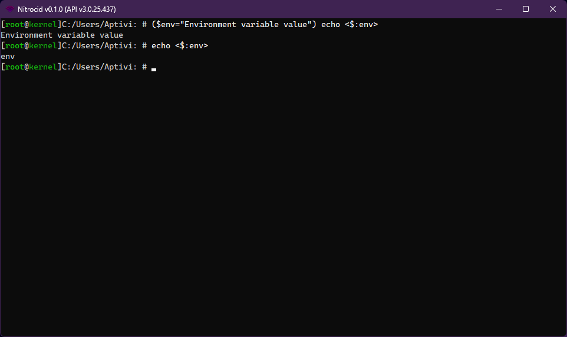

# Shell Structure

Shells can be built by implementing two different interfaces and base classes. Why two? Because the shell handler relies on:

* `BaseShell` and `IShell`: To hold shell type and initialization code
* `BaseShellInfo<ShellType>` and `IShellInfo`: To hold shell commands and the base shell

***

## <mark style="color:$primary;">Shell Handler</mark>

The shell handler, `ShellManager`, uses the available shell list, which holds the `BaseShellInfo` abstract class, to manipulate with that shell. That class can be get, depending on the needed type, with the `ShellManager.GetShellInfo()` function in the ︎`Terminaux.Shell.Shells` namespace.

The shell handler also contains two properties:

| Property           | Description                                                                            |
| ------------------ | -------------------------------------------------------------------------------------- |
| `CurrentShellType` | Returns the current shell type, which can be used with the shell management functions. |
| `LastShellType`    | Returns the last shell type, which is usually the shell that you exited.               |


For `LastShellType`, there are three cases:

* If there are no shells in the shell stack, it returns the primary `Shell`
* If there is only one shell in the stack, it returns the current shell as the last one
* If there are two or more shells in the stack, it returns the last shell type


### <mark style="color:$primary;">Alternate threads for commands</mark>

In cases where shell commands need to summon another command, you can add an alternative thread then execute the appropriate command in said thread.

To add an alternate thread in your command, you can execute `AddAlternateThread()`, then call `GetLine()`. Additionally, you can get how many shells that are currently running using the `ShellCount()` property.

***

## <mark style="color:$primary;">Base Shell</mark>

The `BaseShell` abstract class, which your shell must override, contains the shell type name (`ShellType`), the flag to bail from the shell (`Bail`), and the shell initialization code with the shell arguments (`InitializeShell()`).

```csharp
public class YourShell : BaseShell, IShell
```

The shell initialization code usually waits for the `Bail` value to become `true` (the shell requested bailing, usually done by exiting the shell using the `exit` universal command), as in the below example code.

```csharp
public override void InitializeShell(params object[] ShellArgs)
{
    while (!Bail)
    {
        // Shell code
    }
}
```

While it's waiting for this to happen, the shell does what it's programmed to do, but in two conditions:

*   All shells **must** call the `ShellManager.GetLine()` function, which usually is adaptive to your shell type. This is the below example code inside the shell initialization code to illustrate this:

    ```csharp
    while (!Bail)
    {
        ShellManager.GetLine();
    }
    ```
*   All shells **must** also handle both the `ThreadInterruptedException`, which must set `Bail` to `true`, and the general exceptions, which must also set `Bail` to `true` after dumping the exception to the debugger or to the console. For example, the below example code, inside the `InitializeShell()` function:

    ```csharp
    while (!Bail)
    {
        try
        {
            ShellManager.GetLine();
        }
        catch (ThreadInterruptedException)
        {
            CancellationHandlers.DismissRequest();
            Bail = true;
        }
        catch (Exception ex)
        {
            TextWriterColor.Write("There was an error in the shell. {0}", true, ThemeColorType.Error, ex.Message);
            DebugWriter.WriteDebug(DebugLevel.E, "Shell will have to exit: {0}", vars: [ex.Message]);
            DebugWriter.WriteDebugStackTrace(ex);
            InputTools.DetectKeypress();
            Bail = true;
        }
    }
    ```

The shell registration is required once you're done implementing the shell and all its required values. The function responsible for this action is `ShellManager.RegisterShell()`.


Be sure to unregister your shell using the `UnregisterShell()` function, or the shell registry function will not update your `BaseShellInfo` class in the available shell lists!



Never call `continue` on the general `catch` clause shown above; the shell will enter an infinite loop, depending on how the exception occurs. If you really have to do this, you can use exception filtering to determine whether `continue` should be called on a specific exception type.


***

## <mark style="color:$primary;">Shell Information</mark>

Every `BaseShell` class you create must accompany it with a separate class that implements the `BaseShellInfo` and `IShellInfo` classes, specifying your shell class name when inheriting the generic version of the `BaseShellInfo` class, as in below:

```csharp
internal class YourShellInfo : BaseShellInfo<YourShell>, IShellInfo
```

This is where your commands get together by overriding the `Commands` variable with the new dictionary containing all your commands, like below:

```csharp
public override List<CommandInfo> Commands => new()
{
    new CommandInfo("adduser", "Adds users",
        new[] {
            new CommandArgumentInfo(new[]
            {
                new CommandArgumentPart(true, "username"),
                new CommandArgumentPart(false, "password"),
                new CommandArgumentPart(false, "confirm"),
            }, Array.Empty<SwitchInfo>())
        }, new AddUserCommand(), CommandFlags.Strict),
    (...)
};
```


If you need to know how to define a command information class, consult [here](command-information.md).



The `ShellType` variable found within the `BaseShellInfo` class is a wrapper for the `ShellBase.ShellType` variable for easier access. It's not overridable and is defined like this:

```csharp
public string ShellType => ShellBase.ShellType;
```


### <mark style="color:$primary;">Command flags</mark>

The command flags (`CommandFlags`) can be defined. One or more of the command flags can be defined using the OR (`|`) operator when defining the command flags. These flags are available:

<table><thead><tr><th width="200.33331298828125">Flag</th><th width="89.6666259765625">Value</th><th>Description</th></tr></thead><tbody><tr><td><code>Obsolete</code></td><td>1</td><td>The command is obsolete.</td></tr><tr><td><code>RedirectionSupported</code></td><td>2</td><td>Redirection is supported, meaning that all the output to the commands can be redirected to a file.</td></tr><tr><td><code>Wrappable</code></td><td>4</td><td>This command is wrappable to pages.</td></tr><tr><td><code>Hidden</code></td><td>8</td><td>This command is hidden from the help page.</td></tr></tbody></table>

***

## <mark style="color:$primary;">Optional property overriding</mark>

You can override optional properties that are listed below.

<details>

<summary>Overriding shell presets</summary>

In addition, you can override the `ShellPresets` class with a new dictionary containing all the presets for your shell, like below:

```csharp
public override Dictionary<string, PromptPresetBase> ShellPresets => new()
{
    { "Default", new DefaultPreset() }
};
```

</details>

<details>

<summary>Accepting network connections</summary>

By default, your shells don't accept network connections. To make them accept network connections, you must override the `AcceptsNetworkConnection` so that it holds the value of `true` instead of `false`.

This causes the network connection selector, especially `OpenConnectionForShell()` which can be invoked in your networked shell launch code in your command class, to be able to acknowledge your shell.

```csharp
public override bool AcceptsNetworkConnection => true;
```

You'll have to adapt your shell to take the first argument, `ShellArgs[0]`, as the network connection instance in your `Shell` instance. For example, we've done this to the FTP shell and shell info instances:

<pre class="language-csharp" data-title="FTPShell.cs" data-line-numbers><code class="lang-csharp">public override void InitializeShell(params object[] ShellArgs)
{
    // Parse shell arguments
<strong>    NetworkConnection ftpConnection = (NetworkConnection)ShellArgs[0];
</strong><strong>    FtpClient clientFTP = (FtpClient)ftpConnection.ConnectionInstance;
</strong>
    // Finalize current connection
    FTPShellCommon.clientConnection = ftpConnection;
</code></pre>

<pre class="language-csharp" data-title="FTPShellInfo.cs" data-line-numbers><code class="lang-csharp">internal class FTPShellInfo : BaseShellInfo&#x3C;FTPShell>, IShellInfo
{
    (...)
<strong>    public override bool AcceptsNetworkConnection => true;
</strong>}
</code></pre>

</details>

<details>

<summary>Wrapping input in one line</summary>

By default, all the shells provide you a multi-line prompt, but if you want your input to be in one line wrapped mode, you can override the below property:

```csharp
public override bool OneLineWrap => false;
```

</details>

<details>

<summary>Enabling slash commands</summary>

If your shell meets the following conditions:

* You need to handle written text in a way, and
* You need to use your commands with a slash character,

Then, you need to override the two properties in order for your special non-slash handler to execute:

```csharp
public override bool SlashCommand => true;
public override CommandInfo NonSlashCommandInfo => new CommandInfo(...);
```

</details>

***

## <mark style="color:$primary;">Base command implementation</mark>

The base command is required to be implemented, since it contains overridable command execution code. Your command must implement the command base class below:

```csharp
class YourCommand : BaseCommand, ICommand
```

The only function that you need to override is `Execute()`, which you can override like below:

```csharp
public override void Execute(CommandParameters parameters, ref string variableValue)
```

### <mark style="color:$primary;">Additional overrides</mark>

You can override additional properties available to you below, depending on your requirements.

<details>

<summary>Supporting dumb consoles</summary>

To support dumb consoles that don't support positioning or complex console functions, you can override `ExecuteDumb()`:

```csharp
public override void ExecuteDumb(CommandParameters parameters, ref string variableValue)
```


If you want to support redirection or wrapping, you must either take dumb console support into account on the `Execute()` function by not calling any of the below console wrappers, or you must override the `ExecuteDumb()` function shown above to be compatible with the dumb consoles.

The following wrappers should not be called (explicitly and implicitly) on that function:

* `CursorLeft` (set)
* `CursorTop` (set)
* `ForegroundColor`
* `BackgroundColor`
* `CursorVisible`
* `OutputEncoding`
* `InputEncoding`
* `KeyAvailable`
* `Beep()`
* `Clear()`
* `OpenStandardError()`
* `OpenStandardInput()`
* `OpenStandardOutput()`
* `ReadKey()`
* `ResetColor()`
* `SetCursorPosition()`
* `SetOut()`


</details>

<details>

<summary>Providing extra help</summary>

You can override the extra help function, `HelpHelper()`, like this:

```csharp
public override void HelpHelper()
```

</details>

***

## <mark style="color:$primary;">Registering and unregistering commands</mark>

In order for your command to be usable, applications are now required to register the commands manually using a function that helps doing this. That function is defined in the `CommandManager` class.

<details>

<summary>Registering your command</summary>

In order to register a command, use one of the below functions:


```csharp
public static void RegisterCustomCommand(string ShellType, CommandInfo commandBase) { }
public static void RegisterCustomCommands(string ShellType, CommandInfo[] commandBases) { }
```



If you've registered your commands correctly, the `help` command list should list your commands that you've registered using one of the `RegisterCustomCommand` functions.


</details>

<details>

<summary>Unregistering your command</summary>

Similarly, if your application is going to stop, or if a command is to be unregistered, you can unregister all your commands. You can use the following functions:


```csharp
public static void UnregisterCustomCommand(string ShellType, string commandName) { }
public static void UnregisterCustomCommands(string ShellType, string[] commandNames) { }
```



If you've unregistered your commands correctly, the `help` command list should no longer list them.


</details>

***

## <mark style="color:$primary;">Setting command values</mark>

There is a special switch called `set` that allows your command to set the final variable value to any value. For example, if you run `calc` with the `-set` switch to a variable called `result`, that variable will be set to an output value (in this case an arithmetic result) using the `variableValue` argument.

<details>

<summary>Implementation</summary>

To take advantage of the feature, just write the following code at the end of `Execute()`:

```csharp
variableValue = myValue;
```

...where `myValue` is a string representation of the resulting value that the command produces.

<figure><figcaption></figcaption></figure>

Your commands can now change their behavior, depending on if the `-set` switch was passed to the command. You can use the `parameters.SwitchSetPassed` value just like below:


```csharp
if (!parameters.SwitchSetPassed)
{
    TextWriters.Write(Translate.DoTranslation("You must pass the -set switch with the variable that you want to set this value to."), KernelColorType.Error);
    return KernelExceptionTools.GetErrorCode(KernelExceptionType.ShellOperation);
}
```


</details>

<details>

<summary>Return codes</summary>

Your commands all feature return codes. The return code is zero by default, which means that the command has executed successfully. In case of a failure, some commands may return numbers other than zero, which indicate that there is something wrong when executing a command, possibly due to either a failed operation, a general error, or some other error.

You can change the return code of a command by writing `return 1` or any other number other than zero to indicate failure, or `return 0` to indicate success.


You can get the error code of the last command using the `$MESHErrorCode` variable.


</details>

<details>

<summary>Local variables and commands</summary>

<figure><figcaption></figcaption></figure>

Occasionally, you may run into conditions where you may have to set an environment variable locally before running a command. For example, on your Linux system, if you run a VNC server running on display `:1` and you want to show a GUI application there from the terminal emulator, you'll have to run the command like this:

```shell-session
$ DISPLAY=:1 x_gui_app
```

The same thing can be done for local shell commands, but the syntax is slightly different. You can assign local environment variables before running the command either by using the `set` command, which affects both the current and the future command runs, or you can limit it to just the command that you're going to run using the below syntax:

```
($env=value $env2="value with space") my_mod_command
```

</details>

<details>

<summary>Example</summary>

A real-world example of this is provided (from the `echo` command code):

```csharp
string result = PlaceParse.ProbePlaces(StringArgs);
TextWriterColor.Write(result);
variableValue = result;
```

</details>
