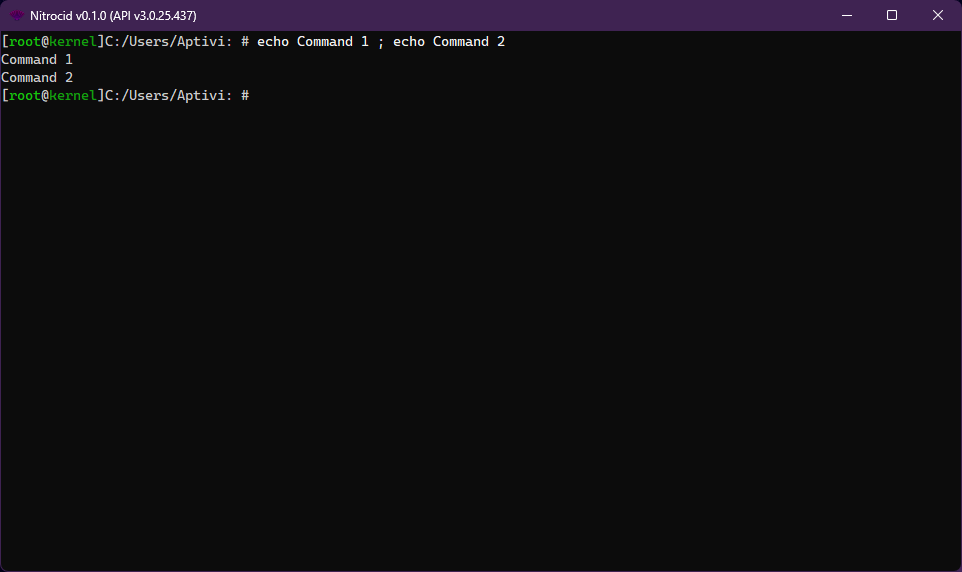
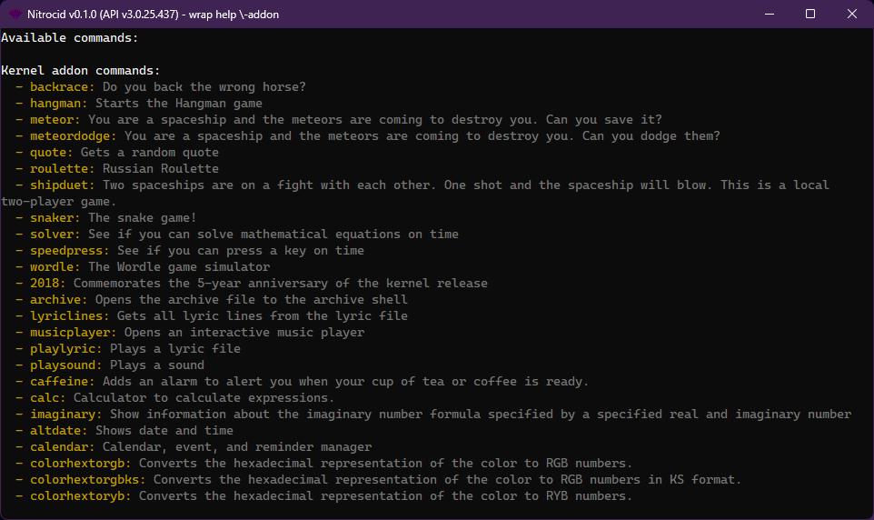

# Command Parsing

If the `GetLine()` function got your input by pressing ENTER, the shell manager attempts to do the following steps:



### <mark style="color:$primary;">Splits the commands separated with semicolons</mark>

It attempts to split any command with the semicolon between them, like:

```
command1 arg1 arg2 ; command2 arg3 arg4
```

<figure><figcaption></figcaption></figure>



### <mark style="color:$primary;">Ignores the comments</mark>

Any command that starts with either a space or a hashtag will be ignored as a comment, like: (Notice the extra space in the first comment)

```
 comment
#comment
```

<figure><figcaption></figcaption></figure>



### <mark style="color:$primary;">Splits the words of arguments</mark>

The first word is a command, and all words following it in a single command text are the series of arguments. These words then get split to arguments (without the switch indicator `-switch`) and switches (arguments that come after the dash) using the `ProvidedArgumentsInfo` class, though it does much more than that.

<details>

<summary>Variables for the provided arguments info class</summary>

This class contains these variables:

| Variable                          | Description                                                        |
| --------------------------------- | ------------------------------------------------------------------ |
| `Command`                         | Target command                                                     |
| `ArgumentsText`                   | Provided arguments and switches                                    |
| `ArgumentsList`                   | Array of arguments without the switches                            |
| `SwitchesList`                    | Array of switches                                                  |
| `RequiredArgumentsProvided`       | Checks to see if the arguments are provided or not                 |
| `RequiredSwitchesProvided`        | Checks to see if the required switches are provided or not         |
| `RequiredSwitchArgumentsProvided` | Checks to see if the required switch arguments are provided or not |

</details>



### <mark style="color:$primary;">Decides the command to be executed</mark>

After the above class constructor is called, the shell attempts to execute an alias command, if found. Else, the built-in command is going to be executed.



### <mark style="color:$primary;">Checks for redirection</mark>

The shell checks for these redirection flags:

<table><thead><tr><th width="109.66668701171875">Flag</th><th width="360">Description</th><th>Example</th></tr></thead><tbody><tr><td><code>>></code></td><td>Redirects the output to a file, overwriting the target file</td><td><code>command >> target.txt</code></td></tr><tr><td><code>>>></code></td><td>Redirects the output to a file, appending to the target file</td><td><code>command >>> target.txt</code></td></tr><tr><td><code>|SILENT|</code></td><td>Redirects the output to a null console driver, which means no output</td><td><code>command |SILENT|</code></td></tr></tbody></table>

If these flags are found, the shell sets the console driver as appropriate.



### <mark style="color:$primary;">Starts the executor thread</mark>

Finally, the command executor thread is fired up with the `ExecuteCommandParameters` instance to hold command execution parameters for the same thread. The thread is then started.



### <mark style="color:$primary;">Checks the nature of the command</mark>

However, the command executor checks for these:

* If the provided command is an MESH script, the shell invokes a script executor.
* If the command is an external program found in the shell lookup path, which is usually `$PATH`, the shell attempts to scan these directories for the program and execute it.
* If the command is an internal command, it creates a separate thread for the command and starts it.



### <mark style="color:$primary;">Wrapped commands</mark>

The `ExecuteCommandWrapped()` function allows you to execute a command in wrapped mode from your commands that have the `CommandFlags.Wrappable` flag.

***

## <mark style="color:$primary;">Command-line Arguments</mark>

The command-line arguments feature is backported from Nitrocid KS with more customization in place. This allows you to create a console application that handles arguments deeply, such as support for argument values.

To parse the arguments, you'll have to define a statically defined dictionary in a static class with a type of `Dictionary<string, ArgumentInfo>`, given that `ArgumentInfo` can be constructed with the following:

<table><thead><tr><th width="169.99993896484375">Variable</th><th>Description</th></tr></thead><tbody><tr><td><code>Argument</code></td><td>The argument name that users will have to write down</td></tr><tr><td><code>HelpDefinition</code></td><td>The description of the argument that will be shown in the help renderer</td></tr><tr><td><code>ArgArgumentInfo</code></td><td>An array of argument info instances that will modify its behavior</td></tr><tr><td><code>ArgumentBase</code></td><td>An argument executor instance that holds the actual code for the argument</td></tr><tr><td><code>Obsolete</code></td><td>Whether this argument is obsolete or not</td></tr></tbody></table>

Afterwards, you can use the `ParseArguments()` function somewhere in the main application code. You can find the relevant classes in the `Terminaux.Shell.Arguments.Base` namespace.

### <mark style="color:$primary;">Command parameters class</mark>

The `CommandParameters` class contains information about the passed command parameters, such as the command text, the argument list, and more. Additionally, you can get the switch value or values, check if a switch is passed or not, and check to see if a switch's value is numeric using available functions in the class.

***

## <mark style="color:$primary;">Special characters</mark>

<figure><figcaption></figcaption></figure>

If a command, such as `wrap`, is set to use the arguments string, you can escape special characters, as long as these characters are known. For example, if you want to pass a switch to a wrapped command, you can use the `wrap` command like this:

```
wrap help \-addon
```
