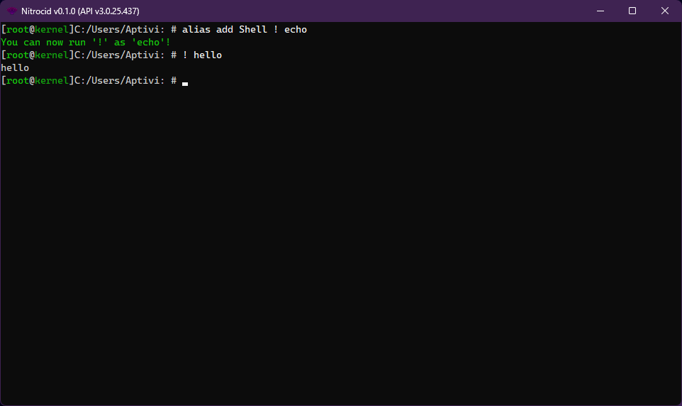

# Extra Shell Features

In addition to all the base shell features that MESH contains, the following extra features can be used within the shell.

***

## <mark style="color:$primary;">Features</mark>

Currently, the following features are supported:

<details>

<summary>Cancellation handling</summary>

You can control whether to allow or not to allow cancellation by using the two functions that do exactly the opposite of each other:

```csharp
// To allow cancellation
CancellationHandlers.AllowCancel()

// To inhibit cancellation
CancellationHandlers.InhibitCancel()
```


The `CancellationHandlers` class can be found in the `Terminaux.Shell.Commands` namespace.


If you call `InhibitCancel()`, it's no longer possible to use `CTRL + C` to cancel the current command. This is useful if the command is in the middle of an uninterruptible work or is in interaction with a native library. When you've already inhibited the shell cancellation handler, if you call `AllowCancel`, then you can use `CTRL + C` to cancel the current command.


You can determine whether the cancellation is requested using the `CancelRequested` property.


However, in order for the cancellation handler to work, you must install the handler using the `InstallHandler()` function. Shells must call `DismissRequest()` in the event of unexpected shell errors.

To override the base cancellation code, you can use `BeginLocalCancelScope()`, passing it with a function that you need to use. Once done, you can use `EndLocalCancelScope()`, specifying the same function that you've used when beginning the local cancel scope.

</details>

<details>

<summary>Wrapping</summary>

As indicated earlier in the command information page, if you enable the wrapping ability in the command flags (`CommandFlags.Wrappable`) for your command, you can use the `wrap` command against your command to be able to see the details of the output of the command without having to scroll (as in Windows).

For example, `jsonbeautify` has been defined with the wrappable flag so that you can use the `wrap` command with it.

```csharp
{ "jsonbeautify",
    new CommandInfo("jsonbeautify", /* Localizable */ "Beautifies the JSON file",
        [
            new CommandArgumentInfo(
            [
                new CommandArgumentPart(true, "jsonfile"),
                new CommandArgumentPart(true, "output"),
            ], [], true)
        ], new JsonBeautifyCommand(), CommandFlags.RedirectionSupported | CommandFlags.Wrappable)
},
```

If your entire screen has been filled and the output isn't done yet, you can use the following controls to be able to control the position:

<table><thead><tr><th width="119.99993896484375">Key</th><th>Action</th></tr></thead><tbody><tr><td><code>Escape</code></td><td>Bails from the wrapped output viewer</td></tr><tr><td><code>Page Up</code></td><td>Scrolls to the previous page</td></tr><tr><td><code>Home</code></td><td>Scrolls to the first page</td></tr><tr><td><code>End</code></td><td>Scrolls to the last page</td></tr><tr><td><code>Any key</code></td><td>Scrolls to the next page</td></tr></tbody></table>

</details>

<details>

<summary>Aliasing</summary>

<figure><figcaption></figcaption></figure>

Additionally, the MESH shell provides you with facility to make aliasing long commands easier than before. The alias management class, `AliasManager`, allows you to manage the shell aliases, like adding aliases, editing them, removing them, and so on.

The built-in aliases that are currently made for you are:

* `ls` -> `list`

Currently, the below functions are available:

| Function                       | Description                                                                                  |
| ------------------------------ | -------------------------------------------------------------------------------------------- |
| `InitAliases()`                | Usually not needed. This populates the list of aliases and lets the shell acknowledge them.  |
| `SaveAliases()`                | Saves the list of aliases to a configuration file found under the kernel configuration path. |
| `AddAlias()`                   | Adds an alias to the list of aliases.                                                        |
| `RemoveAlias()`                | Removes an alias from the list of aliases.                                                   |
| `DoesAliasExist()`             | Checks to see if a particular alias exists.                                                  |
| `GetAliasesListFromType()`     | Gets a list of aliases from a shell type, excluding the built-in ones.                       |
| `GetEntireAliasListFromType()` | Gets a list of aliases from a shell type, including the built-in ones.                       |
| `GetAlias()`                   | Gets information about a specific alias.                                                     |

</details>

<details>

<summary>Command Output piping</summary>

It's possible to pipe the source command output as arguments to the target command. You can now use the `wrap` command to pipe all output to the target command as arguments. For example, if you're piping the output of `ls` to `echo`, you'll run the `wrap -quoted ls echo` command. This command executes two commands:

* `ls`: Executes directory listing command and buffers the output.
* `echo`: Executes the text printing command with the buffered output as parameters, enclosing it with the double quotes if the `-quoted` switch is passed.


If you find that piping command output doesn't work properly, depending on the target command, you'll have to enclose the output with the double quotes by passing `wrap` the `-quoted` switch.

The source command must have the `Wrappable` flag as piping relies on buffering the output.


</details>
